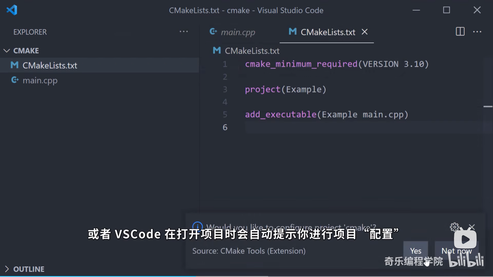
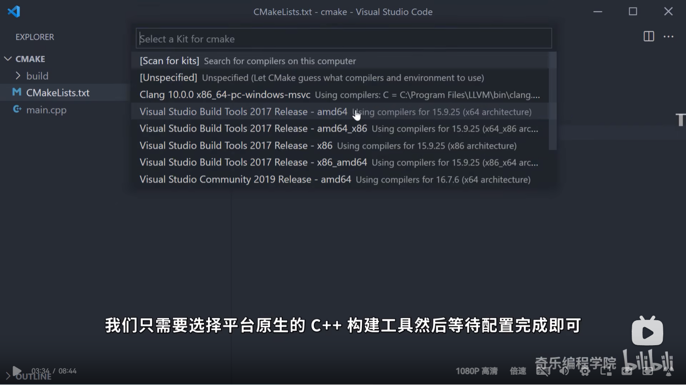

# CMake的使用

> 教程参考：
> >[b站链接](https://www.bilibili.com/video/BV1rR4y1E7n9/)

- [CMake的使用](#cmake的使用)
  - [创建CMakeList.txt](#创建cmakelisttxt)
  - [CMake配置](#cmake配置)
  - [Build](#build)
  - [知乎例子](#知乎例子)


## 创建CMakeList.txt

在项目根目录下创建 `CMakeList.txt` 文件，对于一个简单项目，有一下内容：

```bash
cmake_minimum_required(VERSION 3.10)

project(Example) # 工程名字，后续生成可执行文件也是这个名字

add_executable(Example main.cpp) 

# 上述为基本必须的内容
#=======================================#

find_package(xxx REQUIRED) # xxx为pkg名字，后面为必须，没有则会报错

# 有多个源文件组成，则用以下内容通配所有源文件
file(GLOB SRC_FILES
     "${PROJECT_SOURCE_DIR}/src/*.h"
     "${PROJECT_SOURCE_DIR}/src/*.cpp"
     "${PROJECT_SOURCE_DIR}/src/*.c"
     "${PROJECT_SOURCE_DIR}/src/*.cc") # 全局搜索源文件保存到SRC_FILES下
add_executable(${CMAKE_PROJECT_NAME} ${SRC_FILES}) # CMAKE_PROJECT_NAME是宏，会自动替换为工程名字

# 链接(Link)库，不做会遇到符号解析的错误
target_link_libraries(${CMAKE_PROJECT_NAME} PRIVATE imgui::imgui)

# 用到C++17以上语法，需要以下内容打开C++17支持
target_compile_features(${CMAKE_PROJECT_NAME} PRIVATE cxx_std_17)

# Finally,Copy assets files after build.
add_custom_command(
     TARGET ${CMAKE_PROJECT_NAME}
     POST_BUILD # 编译之后执行的操作
     COMMAND ${CMAKE_COMMAND} -E copy_directory
          "${PROJECT_SOURCE_DIR}/assets"
          "$<TARGET_FILE_DIR:${CMAKE_PROJECT_NAME}>/assets")

```

## CMake配置

在 `Ctrl+shift+p` 选择 `Cmake Config` 或：



选择



## Build

快捷键 `F7` 或 `CMake build` 

一般都是

```bash
mkdir build && cd build && make .. && make -j8 # 并行编译
```

## 知乎例子

参考[链接](https://zhuanlan.zhihu.com/p/59161370)

```bash
# 1. 声明要求的cmake最低版本
cmake_minimum_required( VERSION 2.8 )
​
# 2. 添加c++11标准支持
#set( CMAKE_CXX_FLAGS "-std=c++11" )
​
# 3. 声明一个cmake工程
PROJECT(rpt_main)
​
MESSAGE(STATUS "Project: SERVER") #打印相关消息消息
  
# 4. 头文件
include_directories(
${PROJECT_SOURCE_DIR}/../include/mq 
${PROJECT_SOURCE_DIR}/../include/incl 
${PROJECT_SOURCE_DIR}/../include/rapidjson
)
​
# 5. 通过设定SRC变量，将源代码路径都给SRC，如果有多个，可以直接在后面继续添加
set(SRC 
${PROJECT_SOURCE_DIR}/../include/incl/tfc_base_config_file.cpp 
${PROJECT_SOURCE_DIR}/../include/mq/tfc_ipc_sv.cpp 
${PROJECT_SOURCE_DIR}/../include/mq/tfc_net_ipc_mq.cpp
${PROJECT_SOURCE_DIR}/../include/mq/tfc_net_open_mq.cpp 
${PROJECT_SOURCE_DIR}/local_util.cpp
${PROJECT_SOURCE_DIR}/AgentMemRpt.cpp 
${PROJECT_SOURCE_DIR}/AgentDiskRpt.cpp 
${PROJECT_SOURCE_DIR}/AgentLoadRpt.cpp 
${PROJECT_SOURCE_DIR}/AgentIoRpt.cpp
${PROJECT_SOURCE_DIR}/AgentNetRpt.cpp 
${PROJECT_SOURCE_DIR}/AgentCpuRpt.cpp 
${PROJECT_SOURCE_DIR}/AgentProcessRpt.cpp 
${PROJECT_SOURCE_DIR}/AgentParentRpt.cpp
${PROJECT_SOURCE_DIR}/AgentSysTop_5.cpp 
${PROJECT_SOURCE_DIR}/BaseFeatureRptMain.cpp 
)
​
# 6. 创建共享库/静态库
​
# 设置路径（下面生成共享库的路径）
set(CMAKE_LIBRARY_OUTPUT_DIRECTORY ${PROJECT_SOURCE_DIR}/lib)
# 即生成的共享库在工程文件夹下的lib文件夹中
 
set(LIB_NAME rpt_main_lib)
# 创建共享库（把工程内的cpp文件都创建成共享库文件，方便通过头文件来调用）
# 这时候只需要cpp，不需要有主函数 
# ${PROJECT_NAME}是生成的库名 表示生成的共享库文件就叫做 lib工程名.so
# 也可以专门写cmakelists来编译一个没有主函数的程序来生成共享库，供其它程序使用
# SHARED为生成动态库，STATIC为生成静态库
add_library(${LIB_NAME} STATIC ${SRC})
 
# 7. 链接库文件
# 把刚刚生成的${LIB_NAME}库和所需的其它库链接起来
# 如果需要链接其他的动态库，-l后接去除lib前缀和.so后缀的名称，以链接
# libpthread.so 为例,-lpthread
target_link_libraries(${LIB_NAME} pthread dl)
   
# 8. 编译主函数，生成可执行文件
# 先设置路径
set(CMAKE_RUNTIME_OUTPUT_DIRECTORY ${PROJECT_SOURCE_DIR}/bin)
   
# 可执行文件生成
add_executable(${PROJECT_NAME} ${SRC})
   
# 这个可执行文件所需的库（一般就是刚刚生成的工程的库咯）
target_link_libraries(${PROJECT_NAME} pthread dl ${LIB_NAME})
```