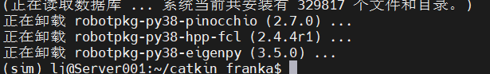
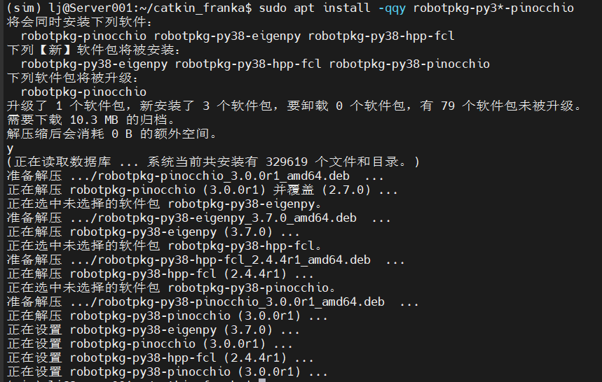
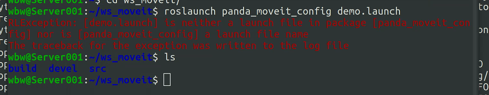
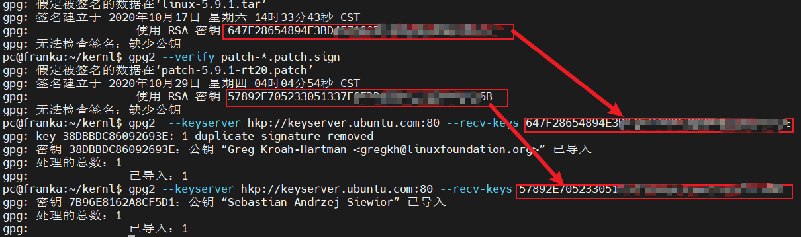
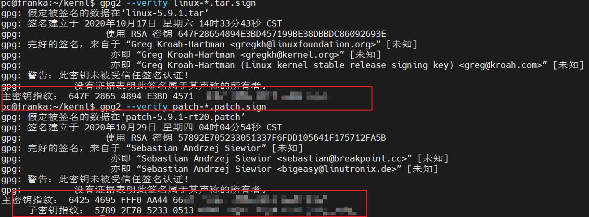
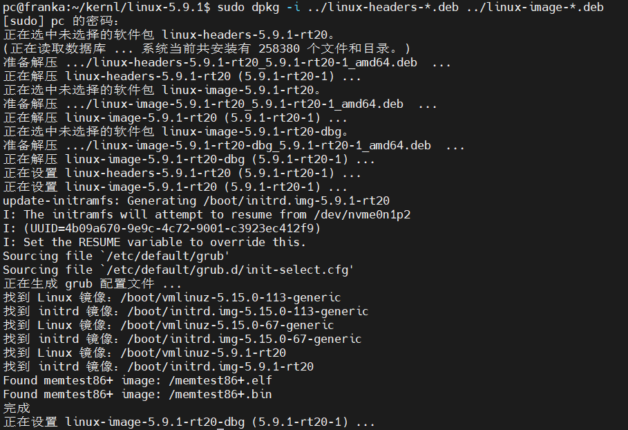
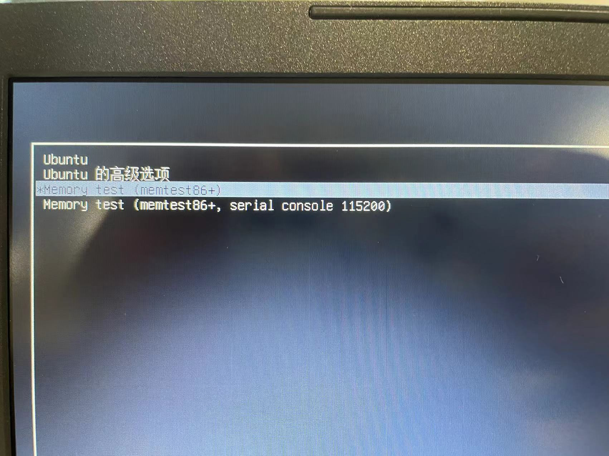
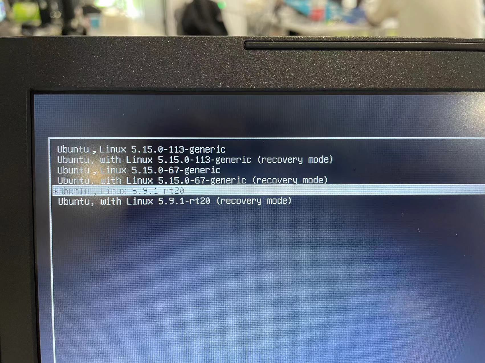

# Franka环境配置
以下环境配置均基于[ROS Noetic (Ubuntu版本)](https://wiki.ros.org/noetic/Installation/Ubuntu)，机械臂基于[Franka Emika Panda](https://github.com/Liujian1997/Franka_env-Installation/Franka_Emika_Panda_Instruction_Handbook_CN.pdf)
- [Franka环境配置](#franka环境配置)
  - [参考链接](#参考链接)
  - [Pinocchio安装](#pinocchio安装)
  - [版本兼容](#版本兼容)
  - [构建libfranka](#构建libfranka)
  - [构建ROS包和Moveit包](#构建ros包和moveit包)
  - [如需安装RT内核](#如需安装rt内核)
  - [Tips：](#tips)
    - [实体通信：](#实体通信)
    - [服务器下多个Gazebo一起调试](#服务器下多个gazebo一起调试)
    - [ROS节点通信（分布式）](#ros节点通信分布式)

<!-- <small><i><a href='http://ecotrust-canada.github.io/markdown-toc/'>Table of contents generated with markdown-toc</a></i></small> -->

## 参考链接
- [ROS Noetic](https://wiki.ros.org/noetic/Installation/Ubuntu)
- [Franka FCI 中文版](https://franka.cn/FCI/overview.html)
- [Moveit Noetic](https://moveit.github.io/moveit_tutorials/doc/getting_started/getting_started.html#)
- [Pinocchio](https://stack-of-tasks.github.io/pinocchio/download.html)

## Pinocchio安装
安装依赖
```bash
sudo apt install -qqy lsb-release curl
```
系统中注册 robotpkg
```bash
sudo mkdir -p /etc/apt/keyrings
 curl http://robotpkg.openrobots.org/packages/debian/robotpkg.asc \
     | sudo tee /etc/apt/keyrings/robotpkg.asc
```
把 robotpkg 添加到apt源码库中
```bash
echo "deb [arch=amd64 signed-by=/etc/apt/keyrings/robotpkg.asc] http://robotpkg.openrobots.org/packages/debian/pub $(lsb_release -cs) robotpkg" \
    | sudo tee /etc/apt/sources.list.d/robotpkg.list
```
更新软件列表
```bash
sudo apt update
```
直接使用以下指令安装pinocchio
```bash
# sudo apt install -qqy robotpkg-py3*-pinocchio 
# 注意：可能出现版本对应不上
sudo apt install robotpkg-py38-pinocchio=2.7.0 robotpkg-pinocchio=2.7.0 robotpkg-py38-eigenpy=3.5.0
```
设置环境变量`vim ~/.bashrc`
```bash
export PATH=/opt/openrobots/bin:$PATH
export PKG_CONFIG_PATH=/opt/openrobots/lib/pkgconfig:$PKG_CONFIG_PATH
export LD_LIBRARY_PATH=/opt/openrobots/lib:$LD_LIBRARY_PATH
export PYTHONPATH=/opt/openrobots/lib/python3.10/site-packages:$PYTHONPATH # Adapt your desired python version here
export CMAKE_PREFIX_PATH=/opt/openrobots:$CMAKE_PREFIX_PATH
```
更新环境变量`source ~/.bashrc`
> Test：卸载后安装通过
> 
> ```bash
> sudo apt remove robotpkg-py3*-pinocchio
> ```
>
> 
> 
> 重新安装通过，会自动安装3.8
>
> 
>
> 会报错！！！！！！！！！！！！！！！！！！！！！
>
> ```bash
> sudo apt install robotpkg-py38-pinocchio=2.7.0 robotpkg-pinocchio=2.7.0 robotpkg-py38-eigenpy=3.5.0
> ```

## 版本兼容


## 构建libfranka
从源代码构建，请先卸载现有的之前（方法一）安装的 libfranka 和 franka_ros 以避免冲突：
```bash
sudo apt remove "*libfranka*"
```
要构建 libfranka，请从 Ubuntu 的包管理器安装以下依赖项：
```bash
sudo apt install build-essential cmake git libpoco-dev libeigen3-dev
```
在安装完成 ROS Noetic 之后，在选择的一个目录中的 Catkin 工作区：
```bash
cd /path/to/desired/folder # 自己的目录
mkdir -p catkin_ws/src
cd catkin_ws
source /opt/ros/noetic/setup.sh
catkin_init_workspace src
```

然后，通过 libfranka 从 GitHub 克隆来下载源代码：

```bash
git clone --recursive https://github.com/frankaemika/libfranka --branch 0.9.1 # Robot system 4.2.2
cd libfranka
```

(非必须)默认情况下，这将检出最新版本的 libfranka. 如果要构建特定版本 libfranka，请查看相应的 Git 标签：

```bash
git checkout <version>
git submodule update
```
在源目录中，创建一个构建目录并运行 CMake：

```bash
mkdir build
cd build
cmake -DCMAKE_BUILD_TYPE=Release -DBUILD_TESTS=OFF ..
cmake --build .
```
## 构建ROS包和Moveit包

然后从 GitHub 克隆 franka_ros 和 Moveit 存储库：
```bash
cd ../../src
git clone --recursive https://github.com/frankaemika/franka_ros # franka_ros
git clone https://github.com/moveit/moveit_tutorials.git -b master # Moveit
git clone https://github.com/moveit/panda_moveit_config.git -b noetic-devel # Moveit
# 如果有其他需要编译的放在这一起编译，也可以单独编译，我们这里同时下载相机的存储库，不需要可以不下载
git clone https://github.com/m-tartari/realsense_gazebo_description.git # Camera
git clone https://github.com/m-tartari/realsense_gazebo_plugin.git # Camera plugin
```
(非必须)默认情况下，这将检出最新版本的 franka_ros，如果要构建特定版本 franka_ros，请查看相应的 Git 标签：
```bash
cd franka_ros
git checkout <version>
```
安装任何缺少的依赖项并构建包：（注意：以下命令中注意将 /path/to/libfranka/build 替换成自己的 libfranka build 构建路径。）
```bash
cd /your path/catkin_ws
rosdep install --from-paths src --ignore-src --rosdistro noetic -y --skip-keys libfranka
catkin_make -DCMAKE_BUILD_TYPE=Release -DFranka_DIR:PATH=/path/to/libfranka/build  # 注意修改路径
source devel/setup.sh
```
配置成功测试：（注：运行前先运行`source devel/setup.sh`避免出现以下错误，可以加到环境变量里）



```bash
roslaunch panda_moveit_config demo.launch
# 另起一个终端
rosrun moveit_tutorials move_group_python_interface_tutorial.py
```

## 如需安装RT内核
参考[链接](https://franka.cn/FCI/installation_linux.html#setting-up-the-real-time-kernel)

注意：`PREEMPT_RT` 内核不支持 NVIDIA 二进制驱动程序。

安装必要的依赖项：
```bash
sudo apt-get install build-essential bc curl ca-certificates gnupg2 libssl-dev lsb-release libelf-dev bison flex dwarves zstd libncurses-dev
```
对于使用内核版本 5.9.1 测试通过的 Ubuntu 20.04：
```bash
curl -SLO https://www.kernel.org/pub/linux/kernel/v5.x/linux-5.9.1.tar.xz
curl -SLO https://www.kernel.org/pub/linux/kernel/v5.x/linux-5.9.1.tar.sign
curl -SLO https://www.kernel.org/pub/linux/kernel/projects/rt/5.9/patch-5.9.1-rt20.patch.xz
curl -SLO https://www.kernel.org/pub/linux/kernel/projects/rt/5.9/patch-5.9.1-rt20.patch.sign
```
解压：
```bash
xz -d *.xz
```
验证文件完整性
```bash
gpg2 --verify linux-*.tar.sign
gpg2 --verify patch-*.patch.sign
```
获取公钥
```bash
gpg2  --keyserver hkp://keyserver.ubuntu.com:80 --recv-keys 6092693E # 注意替换公钥
gpg2 --keyserver hkp://keyserver.ubuntu.com:80 --recv-keys 2872E4CC # 注意替换公钥
```
如图所示对应


重新验证文件完整性
```bash
gpg2 --verify linux-*.tar.sign
gpg2 --verify patch-*.patch.sign
```
如图所示则验证通过



编译内核
提取源代码并应用补丁
```bash
tar xf linux-*.tar
cd linux-*/
patch -p1 < ../patch-*.patch
```
接下来复制当前启动的内核配置作为新实时内核的默认配置：

```bash
cp -v /boot/config-$(uname -r) .config
```

现在可以使用此配置作为默认配置来配置构建：
```bash
make olddefconfig
make menuconfig # 会出界面
```
可以在其中配置抢占模型。使用箭头键导航到 `General Setup` > `Preemption Model` 并选择 `Fully Preemptible Kernel (Real-Time)` 。

之后导航到 `Cryptographic API` > `Certificates for signature checking` （在列表的最底部）> `Provide system-wide ring of trusted keys` > `Additional X.509 keys for default system keyring`

从提示符中移除 “`debian/canonical-certs.pem`”，然后按OK。将此配置保存到 `.config` 并退出 `TUI`。我们建议将其他选项保留为默认值。

之后，就可以编译内核了。由于这是一个漫长的过程，请将多线程选项 -j 设置为 CPU 核心数量，也可以直接使用下面的命令：

```bash
make -j$(nproc) deb-pkg
```

最后，已准备好安装新创建的包。确切的名称取决于环境，但要查找的是不带 `dbg` 后缀的 `headers` 和 `images` 包。然后安装：（提示：如果编译结束后，给内核打 `deb` 格式包的时候报错：`recipe for traget 'deb-pkg' failed.` 则去到现在编译这个目录下 `ctrl+h` 显示隐藏文件，找到并且修改 `.config` 文件，把 `CONFIG_MODULE_SIG_ALL`、`CONFIG_MODULE_SIG_KEY`、`CONFIG_SYSTEM_TRUSTED_KEYS` 三项注释掉，编译时系统会自动生成一次性密钥来加密，把 `CONFIG_DEBUG_INFO=y` 去掉，不然新内核带巨量 debug 信息占用硬盘磁盘空间。然后重新运行 `make -j$(nproc) deb-pkg` 。）

```bash
sudo dpkg -i ../linux-headers-*.deb ../linux-image-*.deb # 有NVIDIA驱动则会在这一步报错
```



验证内核
重新启动系统。启动时按住 `shift` 键。 `Grub` 启动菜单选择 `Ubuntu的高级选项` ，然后选择 `Ubuntu, Linux 5.9.1-rt20`





现在应该允许选择新安装的内核。

选好启动项登录成功后，如果要查看当前正在使用的是不是前面步骤安装的实时内核，请查看 `uname -a` 命令的输出。它应该包含选择的 `PREEMPT RT` 字符串和版本号。此外， `/sys/kernel/realtime` 应该存在，并包含数字 `1`。

在安装 PREEMPT_RT 内核并成功运行后，添加一个名为 realtime 的组 ，并将控制的机器人的用户添加到该组中：
```bash
sudo addgroup realtime
sudo usermod -a -G realtime $(whoami)
```
然后，将以下限制添加到在 `/etc/security/limits.conf` 文件中的 realtime 组
```bash
@realtime soft rtprio 99
@realtime soft priority 99
@realtime soft memlock 102400
@realtime hard rtprio 99
@realtime hard priority 99
@realtime hard memlock 102400
```

ssh使用root连接时出现 `Access denied` ，将用户名改成 `pc` 即可。（根据自己名字修改）

---
## Tips：
### 实体通信：
进入 `libfranka/build/examples`
```bash
./communication_test Arm_IP # 替换为机器人IP
```
如果测过不通过则不能进行下一步

### 服务器下多个Gazebo一起调试
开启不同URI的ROS MASTER
```bash
roscore -p YOUR_Port # 不同用户设置不同端口号，默认为11311
```
在执行上述命令后，再开启一个终端，执行`vim ~/.bashrc`
```bash
export ROS_MASTER_URI='http://localhost:YOUR_Port' ## 替换自己的端口号
export GAZEBO_MASTER_URI=http://localhost:YOUR_Gazebo_Port ## 与ros master类似,重新设置，默认在地址为11345，多人时会冲突
```
### ROS节点通信（分布式）
在[上一步](#服务器下多个gazebo一起调试)的基础上替换IP，前提是相互之间**可以`Ping`通**。

**主机**
```bash
export ROS_MASTER_URI='http://主机IP:YOUR_Port' ## 替换自己的端口号
export ROS_HOSTNAME=主机IP
```
**从机**
```bash
export ROS_MASTER_URI='http://主机IP:YOUR_Port' ## 替换自己的端口号
export ROS_HOSTNAME=从机IP # 注意这里是从机IP
```