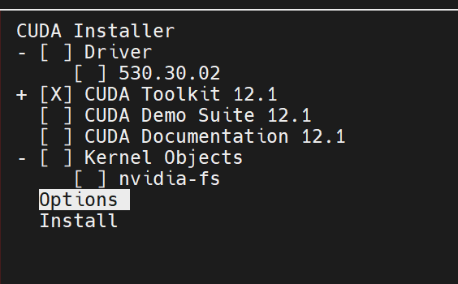
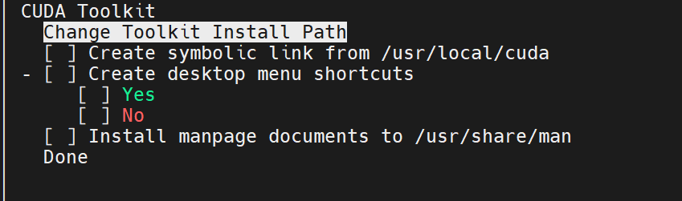
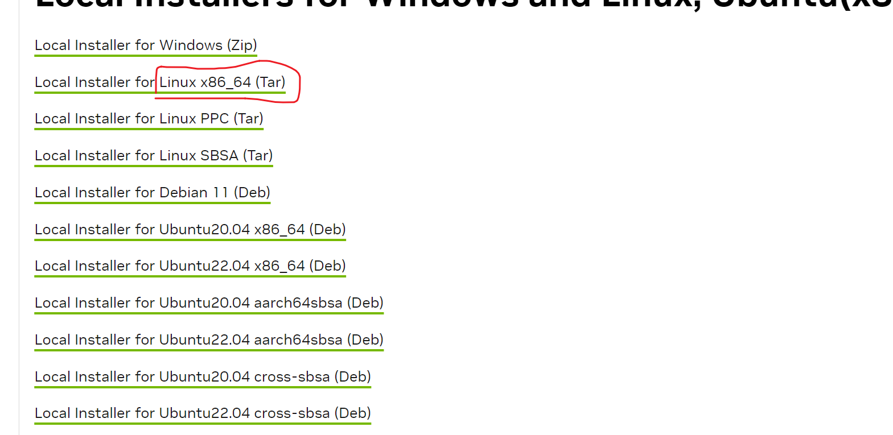
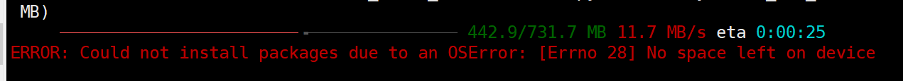

# Conda+Cuda（无sudo权限）环境配置
基于Ubuntu 22.04
- [Conda+Cuda（无sudo权限）环境配置](#condacuda无sudo权限环境配置)
  - [Conda安装](#conda安装)
  - [无sudo权限安装Cuda](#无sudo权限安装cuda)
  - [安装Cudnn](#安装cudnn)
  - [修改hugging face的模型默认下载目录](#修改hugging-face的模型默认下载目录)
  - [pip报以下错误：](#pip报以下错误)
## Conda安装
参考[Anaconda3](https://docs.anaconda.com/anaconda/install/linux/)

下载：
```bash
wget https://repo.anaconda.com/archive/Anaconda3-2023.09-0-Linux-x86_64.sh
```
安装：
```bash
bash Anaconda3-2023.09-0-Linux-x86_64.sh
```
第一个输入 `yes` ，to agree to the license agreement

长按空格，到下一步输入安装路径 `/home/guest/workspace/Anaconda3`。注：所有环境均要安装在 `workspace` 目录下

下一步是否初始化，直接 `yes` ，然后激活 `base` 环境就可以了。

如果还是不能激活 `base` 环境：
```bash
# Replace <PATH_TO_CONDA> with the path to your conda install
source <PATH_TO_CONDA>/bin/activate # 替换成自己的conda安装目录
conda init
```
 
---

## 无sudo权限安装Cuda
[教程参考](https://zhuanlan.zhihu.com/p/701577195) 

[官网下载链接](https://developer.nvidia.com/cuda-toolkit-archive)

选择所需cuda版本，架构和Ubuntu版本可以通过命令查询：
```bash
uname -a 
lsb_release -a
```
选择对应版本，最后一个 `Installer Type` 选择 `runfile (local)` ，然后根据下面 `Base Installer` 下载：
```bash
wget wget https://developer.download.nvidia.com/compute/cuda/12.1.0/local_installers/cuda_12.1.0_530.30.02_linux.run # 这里以12.1版本为例
sh cuda_12.1.0_530.30.02_linux.run # 注意：有sudo权限就加上，没有就安装到自己目录下
```
如果报以下错误：
```bash
Extraction failed.
Ensure there is enough space in /tmp and that the installation package is not corrupt
Signal caught, cleaning up
```
在一个空间足够大的目录，创建临时文件
```bash
mkdir tmpspace # 名字随意
sh cuda_12.1.0_530.30.02_linux.run --tmpdir /your/path/to/tmpspace
```
第一个界面输入 `accept` ，然后只保留 `CUDA Toolkit 12.1` ，然后进入 `Options`，如下图



选择 `Toolkit Options` 进入，所有全部取消，进入 `Change Toolkit Install Path`，改成 `/home/guest/workspace/cuda-12.1/`，因为是 `/usr/local` 则需要sudo权限。



剩下直接安装即可，出现 `Summary` 则表示安装成功，之后则需要配置环境变量 `vim ~/.bashrc`，如果按照默认安装路径则需要如下配置：
```bash
export PATH=/usr/local/cuda12.1/bin:$PATH
export LD_LIBRARY_PATH=/usr/local/cuda12.1/lib64:$LD_LIBRARY_PATH
```
由于没有sudo权限，cuda安装在自己目录下，则需要替换：
```bash
export PATH=/home/guest/workspace/cuda-12.1/bin:$PATH
export LD_LIBRARY_PATH=/home/guest/workspace/cuda-12.1/lib64:$LD_LIBRARY_PATH
```
配置完成之后 `source ~/.bashrc`

## 安装Cudnn
[下载链接](https://developer.nvidia.com/rdp/cudnn-archive#a-collapse805-111)

选择cuda对于版本的Cudnn，需要登陆才能下载：



解压文件：
```bash
tar -xvf cudnn-linux-x86_64-8.9.6.50_cuda12-archive.tar.xz
```

将解压后的头文件和库复制到cuda目录中：

```bash
cd cudnn-linux-x86_64-8.9.6.50_cuda12-archive
cp include/cudnn*    /home/guest/workspace/cuda-12.1/include # 注意和自己cuda路径对应
cp lib/libcudnn*    /home/guest/workspace/cuda-12.1/lib64 
chmod a+r /home/guest/workspace/cuda-12.1/include/cudnn*   /home/guest/workspace/cuda-12.1/lib64/libcudnn*
```

检查是否安装成功：
```bash
nvcc -V # 检查cuda版本
cat /home/guest/workspace/cuda-12.1/include/cudnn_version.h | grep CUDNN_MAJOR -A 2 # 检查Cudnn版本
```

## 修改hugging face的模型默认下载目录
在 `vim ~/.bashrc` 加上：
```bash
export HF_HOME="目标地址"
```
参考[huggingface](https://huggingface.co/docs/huggingface_hub/package_reference/environment_variables)

下载设置：
```bash
export HF_ENDPOINT=https://hf-mirror.com
```

## pip报以下错误：



```bash
pip config set global.cache-dir "/data/guest_workspace/cache/pipcache" # 这个不确定管用
export TMPDIR='/data/guest_workspace/tmpspace' # 这个管用
```

