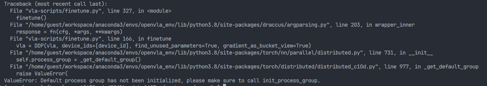
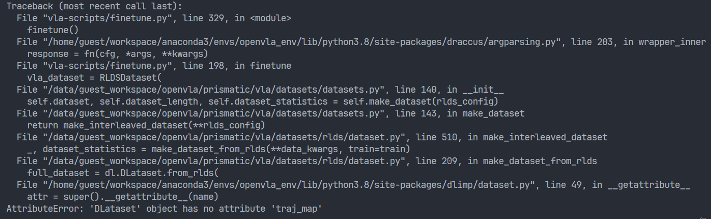

# openvla复现

## 数据集部分

> 该部分基于Franka Panda机械臂，数据集基于Droid数据集

### 数据集预处理

<https://github.com/moojink/rlds_dataset_mod>

环境构建时间过长：

1. 构建激活新环境

```bash
conda create --name rlds_env python=3.9
conda activate rlds_env
```

2. 安装依赖

根据 `environment.yml` 文件中的依赖列表，逐个安装依赖。你可以使用 `conda` 和 `pip` 来安装这些包。

```bash
conda install -c conda-forge _libgcc_mutex=0.1 _openmp_mutex=4.5 ca-certificates=2023.7.22 ld_impl_linux-64=2.40 libffi=3.3 libgcc-ng=13.1.0 libgomp=13.1.0 libsqlite=3.42.0 libstdcxx-ng=13.1.0 libzlib=1.2.13 ncurses=6.4 openssl=1.1.1u pip=23.2.1 readline=8.2 setuptools=68.0.0 sqlite=3.42.0 tk=8.6.12 tzdata=2023c wheel=0.41.0 xz=5.2.6 zlib=1.2.13
```

3. 使用 Pip 安装依赖

```bash
pip install absl-py==1.4.0 anyio==3.7.1 apache-beam==2.49.0 appdirs==1.4.4 array-record==0.4.0 astunparse==1.6.3 cachetools==5.3.1 certifi==2023.7.22 charset-normalizer==3.2.0 click==8.1.6 cloudpickle==2.2.1 contourpy==1.1.0 crcmod==1.7 cycler==0.11.0 dill==0.3.1.1 dm-tree==0.1.8 dnspython==2.4.0 docker-pycreds==0.4.0 docopt==0.6.2 etils==1.3.0 exceptiongroup==1.1.2 fastavro==1.8.2 fasteners==0.18 flatbuffers==23.5.26 fonttools==4.41.1 gast==0.4.0 gitdb==4.0.10 gitpython==3.1.32 google-auth==2.22.0 google-auth-oauthlib==1.0.0 google-pasta==0.2.0 googleapis-common-protos==1.59.1 grpcio==1.56.2 h11==0.14.0 h5py==3.9.0 hdfs==2.7.0 httpcore==0.17.3 httplib2==0.22.0 idna==3.4 importlib-metadata==6.8.0 importlib-resources==6.0.0 keras==2.13.1 kiwisolver==1.4.4 libclang==16.0.6 markdown==3.4.3 markupsafe==2.1.3 matplotlib==3.7.2 numpy==1.24.3 oauthlib==3.2.2 objsize==0.6.1 opt-einsum==3.3.0 orjson==3.9.2 packaging==23.1 pathtools==0.1.2 pillow==10.0.0 plotly==5.15.0 promise==2.3 proto-plus==1.22.3 protobuf==4.23.4 psutil==5.9.5 pyarrow==11.0.0 pyasn1==0.5.0 pyasn1-modules==0.3.0 pydot==1.4.2 pymongo==4.4.1 pyparsing==3.0.9 python-dateutil==2.8.2 pytz==2023.3 pyyaml==6.0.1 regex==2023.6.3 requests==2.31.0 requests-oauthlib==1.3.1 rsa==4.9 sentry-sdk==1.28.1 setproctitle==1.3.2 six==1.16.0 smmap==5.0.0 sniffio==1.3.0 tenacity==8.2.2 tensorboard==2.13.0 tensorboard-data-server==0.7.1 tensorflow==2.13.0 tensorflow-datasets==4.9.2 tensorflow-estimator==2.13.0 tensorflow-hub==0.14.0 tensorflow-io-gcs-filesystem==0.32.0 tensorflow-metadata==1.13.1 termcolor==2.3.0 toml==0.10.2 tqdm==4.65.0 typing-extensions==4.5.0 urllib3==1.26.16 wandb==0.15.6 werkzeug==2.3.6 wrapt==1.15.0 zipp==3.16.2 zstandard==0.21.0 dlimp @ git+https://github.com/kvablack/dlimp@fba663b10858793d35f9a0fdbe8f0d51906c8c90
```

如果最后一个包安装失败，可以尝试手动安装

```bash
git clone https://github.com/kvablack/dlimp@fba663b10858793d35f9a0fdbe8f0d51906c8c90
cd dlimp
python setup.py install 或者 pip install .
# 或者
pip install dlimp @ git+https://github.com/kvablack/dlimp@fba663b10858793d35f9a0fdbe8f0d51906c8c90
```

## 巨坑

```python
builder = tfds.builder(FLAGS.dataset, data_dir=FLAGS.data_dir)
```

上述代码中的数据集加载方式需要谷歌令牌，否则会访问不到，即便下已经下载了数据集。

后续：让它冷静一下，就好了。会跳过这个步骤。

## bug

> openvla 微调版本需要python=3.10，Interface >= 3.8



```Python
if not dist.is_initialized():
     dist.init_process_group(backend='nccl')
# Wrap VLA in PyTorch DDP Wrapper for Multi-GPU Training
vla = DDP(vla, device_ids=[device_id], find_unused_parameters=True, gradient_as_bucket_view=True)
```

168行左右修改



注意：这里不要使用数据预处理环境中的 `dlimp`, 使用 `https://github.com/openvla/openvla/blob/main/pyproject.toml` 中的 `dlimp`

```bash
# 这个pkg依赖TensorFlow 2.15.0，使用之前的环境会冲突
pip install git+https://github.com/moojink/dlimp_openvla
```

