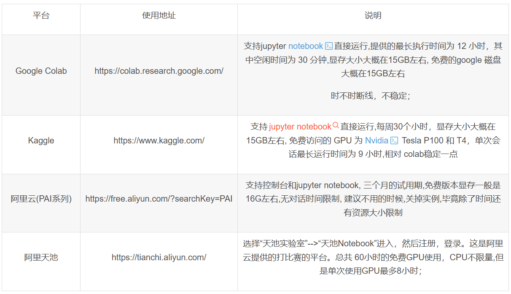

# 零基础入门

---

- [零基础入门](#零基础入门)
  - [计算资源申请](#计算资源申请)
    - [低配置参考](#低配置参考)
    - [高配置参考](#高配置参考)
    - [各种环境配置参考](#各种环境配置参考)
  - [基础课程学习](#基础课程学习)
  - [进阶课程学习](#进阶课程学习)
    - [论文阅读 Attention Is All You Need](#论文阅读-attention-is-all-you-need)
    - [实验部分](#实验部分)

## 计算资源申请

> [!NOTE]
> 自己电脑配置较低可以参考低配置部分，如电脑配置较高，有独立显卡且显存在8G以上，则可以在自己电脑配置WSL，参考高配置部分。第三部分为各种环境配置参考，可以先简单学习linux操作，再根据后续需要配置环境。

### 低配置参考

推荐第三个，申请教程如下：

https://blog.csdn.net/wangguangguang06/article/details/137870586

ssh配置参考：

https://help.aliyun.com/zh/pai/user-guide/connect-to-dsw-instance/

### 高配置参考

https://zhuanlan.zhihu.com/p/515927797

### 各种环境配置参考

https://zhuanlan.zhihu.com/p/676491841

## 基础课程学习

> [!NOTE]
> 在开始以下课程时，需要先完成计算资源申请或wsl配置，了解ssh连接方式，以及基本的linux操作。

https://zh.d2l.ai/

共计15课时（只需要学习pytorch版），pdf以及视频链接如下：

https://zh-v2.d2l.ai/d2l-zh-pytorch.pdf

https://www.zhihu.com/education/video-course/1647604835598092705

## 进阶课程学习

### 论文阅读 Attention Is All You Need

https://arxiv.org/pdf/1706.03762

### 实验部分

在WMT 2014 English-German dataset上面完成实验，并且和原论文table2对比。

可以参考以下资料（一定要自己动手写，不要复制代码，因为我不需要你们给我交差，而是给你们自己交差）：

https://blog.csdn.net/m0_59772307/article/details/137904087

https://www.cnblogs.com/kongen/p/18088002
